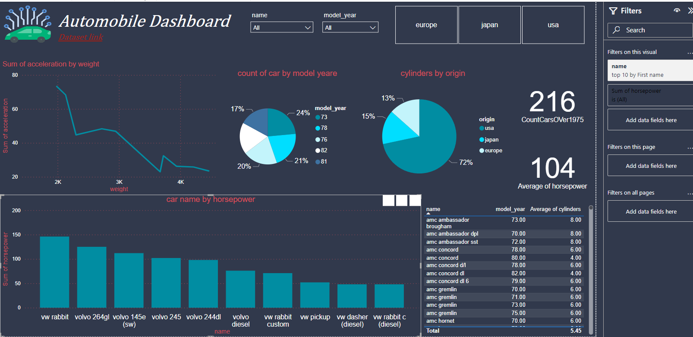

# GDSC---Data-Analysis-project
Car Info Data analysis using Python + SQL + Power BI + Power Query

# Table of Contents
1.**Introduction**

2.**Overview Dashboard**

3.**Dataset**

4.**Python EDA and Visualization**

5.**SQL**

6.**Power Query**

7.**Usage**

# Intoduction
This project aims to analysis car information dataset using Python, SQl and Power BI

# Overview Dashboard

**Process of the project**

This project analyze the car automobile dataset and get insights from this data to help the stakeholders to undersand thje data and how it's gone.
First I analyze my data using python for EDA, Data cleaning and some data visualizations, Then I go to SQL to answer to some KPIs the stakeholder asks for and finally I used to Power BI to visual my interactive dashboard to make it better to understood.

# Dataset

The dataset contains the following columns:

name
Unique identifier for each automobile.

mpg
Fuel efficiency measured in miles per gallon.

cylinders
Number of cylinders in the engine.

displacement
Engine displacement, indicating its size or capacity.

horsepower
Power output of the engine

weight
Weight of the automobile.

acceleration
Capability to increase speed, measured in seconds.

model_year
Year of manufacture for the automobile model.

origin
Country or region of origin for each automobile.

# Python for EDA and Visualization

I utilized Python for Exploratory Data Analysis (EDA), data cleansing, and proficient data visualization to ensure a comprehensive and precise understanding of the dataset. Python's versatile libraries allowed me to perform intricate data cleaning tasks, ensuring data integrity and consistency. Moreover, employing advanced visualization techniques enabled the creation of insightful graphical representations that facilitated easy comprehension and acceptance by users.

# SQL
**SQl queries**
the sql queris contains a 11 type of queries:
1. KPI's
2. 	Body Style Popularity
3. 	Average Miels Per Gallon for each years
4.  Count of cars by number of cylinders
5. 	Max/Min horsepower and Max/Min displacement by car model 
6. 	Total cars produced between 1970 and 1980
7. 	Average car weight per model
8. 	Average car weight per model
9. 	Top 5 car manufacturers by average highway mpg

to Download the SQL KPIs documentation [Click Here](https://github.com/zyad-alsharnobi/GDSC---Data-Analysis-project/blob/main/bootcamp.docx)

# Power Query
I used Power Query to clean and preprocess my data before visualizing it, following a series of steps:
1. to make first row as Headers
2. to change the columns datatypes

# Usage
to acces the Dashboard [Click Here](https://github.com/zyad-alsharnobi/GDSC---Data-Analysis-project/blob/main/Automobile%20Dashboard.pbix)

to access Python notebook [Click Here](https://github.com/zyad-alsharnobi/GDSC---Data-Analysis-project/blob/main/car-info-data-analysis.ipynb)

to access the SQL Kpis and Documentation [Click Here](https://github.com/zyad-alsharnobi/GDSC---Data-Analysis-project/blob/main/bootcamp.docx)

to access the Dataset [Click Here](https://www.kaggle.com/datasets/tawfikelmetwally/automobile-dataset)

